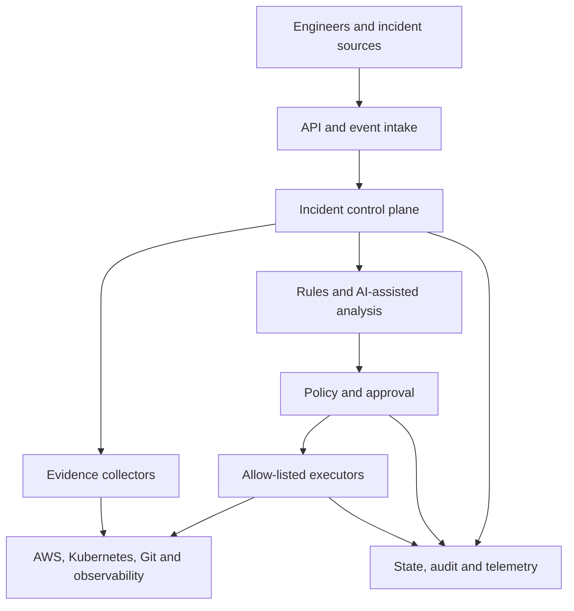

# OpsPilot

[](LICENSE)
[](https://github.com/standardforever/ops_pilot)

**Safe, explainable infrastructure operations.**

OpsPilot is an operations platform for collecting infrastructure evidence, analyzing incidents, and coordinating policy-controlled responses across cloud-native environments.

The project is built around a simple rule: analysis may be automated, but infrastructure changes must remain explainable, auditable, permission-bounded, and reversible.

## Why OpsPilot?

Infrastructure incidents rarely have a single source of truth. Engineers often need to correlate alerts, metrics, logs, deployment history, configuration, Kubernetes state, and cloud resources before they can identify a likely cause.

OpsPilot brings that investigation into one controlled workflow:

1. Receive and normalize an incident.
2. Collect evidence from approved sources.
3. Produce evidence-linked hypotheses and recommendations.
4. Evaluate proposed actions against risk and policy.
5. Request approval where required.
6. Execute only allow-listed operations.
7. Verify and audit the outcome.

## Key capabilities

OpsPilot is being designed to provide:

- **Incident intake** — validated REST and event-driven incident ingestion.
- **Evidence collection** — metrics, logs, traces, Git history, deployments, Kubernetes state, and AWS resource context.
- **Explainable analysis** — deterministic rules and AI-assisted analysis with evidence references, confidence, and uncertainty.
- **Policy and approval** — risk classification, policy-as-code evaluation, and human approval gates.
- **Controlled execution** — allow-listed actions, least-privilege credentials, dry runs, timeouts, rollback, and post-action verification.
- **Operational auditability** — correlated logs, metrics, traces, decisions, approvals, actions, and outcomes.

## Architecture

OpsPilot uses a control-plane architecture that separates incident orchestration, analysis, policy, approval, and execution.



| Component | Responsibility |
|---|---|
| Intake | Authenticate, validate, normalize, deduplicate, and correlate operational signals |
| Incident control plane | Manage workflow state, evidence requests, retries, timeouts, and escalation |
| Evidence collectors | Retrieve read-only context through source-specific, least-privilege integrations |
| Analysis engine | Produce evidence-linked hypotheses, confidence, and proposed actions |
| Policy and approval | Evaluate risk, environment, permission, and required authorization |
| Execution adapters | Perform narrow, allow-listed actions using short-lived credentials |
| State and audit | Preserve incident state, decisions, approvals, actions, and outcomes |
| Observability | Expose the platform's logs, metrics, traces, dashboards, and alerts |

See the [architecture overview](docs/architecture/overview.md) for component boundaries, operational flow, deployment mapping, and trust assumptions.

## Safety model

OpsPilot follows these design principles:

- Read-only integrations before write capability
- Least-privilege and short-lived credentials
- Separation of analysis, approval, and execution
- Fail-closed behavior when policy, evidence, or verification is incomplete
- Allow-listed actions instead of arbitrary command execution
- Human approval for production, destructive, ambiguous, or high-risk changes
- Rollback or compensating procedures for mutating actions
- Secret redaction and complete correlation of important events

OpsPilot does not give an AI model unrestricted infrastructure access or allow an analysis component to approve its own privileged action.

## Technology

The planned platform uses:

| Area | Technologies |
|---|---|
| Application | Linux, Python, FastAPI, Pydantic |
| Quality | pytest, Ruff, mypy, dependency and security scanning |
| Containers and CI | Docker, Docker Compose, GitHub Actions |
| Cloud | AWS |
| Infrastructure | Terraform and Ansible where appropriate |
| Orchestration and packaging | Kubernetes and Helm |
| Observability | Prometheus, Grafana, structured logs, and distributed tracing |
| GitOps delivery | Argo CD |
| Security | AWS IAM, secret management, policy-as-code, image scanning, and audit controls |

Technology choices are introduced through architecture decision records and must be justified by security, reliability, operational complexity, and cost.

## Project status

OpsPilot is currently **pre-alpha**. The architecture and core platform are under active development; there is no production release or supported installation package yet.

- [Open issues](https://github.com/standardforever/ops_pilot/issues)
- [Repository](https://github.com/standardforever/ops_pilot)

## Getting started

The repository can currently be cloned for architecture review and contribution:

```bash
git clone https://github.com/standardforever/ops_pilot.git
cd ops_pilot
```

Installation, configuration, local startup, and demonstration commands will be published after they have been implemented and verified from a clean environment.

## Documentation

- [Architecture overview](docs/architecture/overview.md)

Requirements, architecture decision records, API contracts, threat models, and runbooks will be added under `docs/` as their implementations are approved.

## Contributing

OpsPilot is early in development. Before starting work:

1. Review the open issues and select one whose dependencies are complete.
2. Keep the change within the issue's scope and acceptance criteria.
3. Include tests, security considerations, and documentation with the implementation.
4. Link the pull request to the issue and provide verification evidence.

Detailed contribution and local-development instructions will be published in `CONTRIBUTING.md` as the core platform is implemented.

## Security

Do not disclose suspected vulnerabilities, credentials, private endpoints, or sensitive infrastructure details through a public issue.

A private reporting process and supported-version policy will be documented in `SECURITY.md`. Until then, the project must not be treated as production-ready.

## License

OpsPilot is available under the [MIT License](LICENSE).
