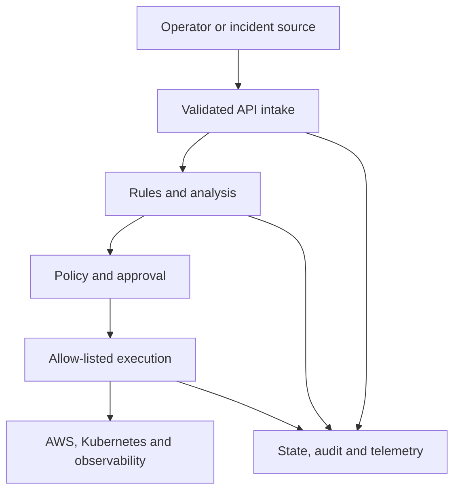

# OpsPilot

[](https://github.com/standardforever/ops_pilot/actions/workflows/ci.yml)
[](LICENSE)
[](https://github.com/standardforever/ops_pilot)

**Safe, explainable infrastructure operations.**

OpsPilot is an operations platform for collecting infrastructure evidence, analyzing incidents, and coordinating policy-controlled responses across cloud-native environments. Its core design rule is that automated analysis must remain evidence-linked, auditable, permission-bounded, and separate from authorization and execution.

The project is pre-alpha. The current release is a local, deterministic, read-only analysis service; it does not connect to or modify real infrastructure.

## Why OpsPilot

Infrastructure incidents rarely have one source of truth. Engineers correlate alerts, metrics, logs, deployments, configuration, Kubernetes state, and cloud resources before deciding what failed and what is safe to do next. That process is slow, difficult to reproduce, and dangerous to automate without clear trust boundaries.

OpsPilot is designed to turn that investigation into a controlled workflow:

1. Validate and normalize an incident.
2. Collect evidence from approved read-only sources.
3. Produce evidence-linked hypotheses with explicit uncertainty.
4. Evaluate proposed actions against risk and policy.
5. Require independent approval where appropriate.
6. Execute only typed, allow-listed operations.
7. Verify and audit the outcome.

## Current capabilities

The repository currently provides:

- A versioned FastAPI incident-analysis API
- Strict Pydantic contracts for incidents, evidence, hypotheses, recommendations, actions, triage plans, and audit events
- Deterministic analysis for high CPU, low disk space, and failed health-check signals
- A low-confidence fallback for unknown signals
- Read-only action invariants enforced by the domain model
- Correlation IDs, structured JSON logs, central redaction, and typed audit events
- A non-root, read-only Docker Compose runtime
- Formatting, linting, strict typing, tests, coverage, dependency audit, source analysis, and secret scanning
- CI container builds, high/critical vulnerability scanning, and live HTTP smoke tests

Cloud collection, AI-assisted analysis, policy services, approvals, infrastructure execution, and production deployment are roadmap capabilities, not current behavior.

## Quick start

### Prerequisites

- Git
- Docker Engine with Docker Compose v2
- `make`
- Python 3.12+ and [uv](https://docs.astral.sh/uv/) for direct local development

Clone and start the hardened local service:

```bash
git clone https://github.com/standardforever/ops_pilot.git
cd ops_pilot
make up
make smoke
```

The API is available at `http://127.0.0.1:8000`; interactive OpenAPI documentation is available at `http://127.0.0.1:8000/docs` in the local Compose configuration.

Run the complete demonstration:

```bash
make demo
```

Stop the service:

```bash
make down
```

For direct Python development:

```bash
make bootstrap
make verify
make run
```

See the [local-development runbook](docs/runbooks/local-development.md) for operating procedures and troubleshooting.

## API example

Submit a synthetic incident:

```bash
curl --fail-with-body \
  --header 'Content-Type: application/json' \
  --header 'X-Correlation-ID: readme-example' \
  --data @tests/fixtures/incidents/high_cpu.json \
  http://127.0.0.1:8000/v1/incidents/analyze
```

The response contains the evidence considered, a bounded-confidence hypothesis, read-only investigation recommendations, limitations, and correlation/audit identifiers. The service never treats a recommendation as permission to execute.

## Architecture

The implemented slice keeps transport, contracts, analysis, and audit output separate. Future platform components extend these boundaries rather than bypassing them.



Only the API, deterministic analysis, and structured audit path are currently implemented. Policy, approval, execution, and external platform adapters remain outside the reachable runtime.

Read the [architecture overview](docs/architecture/overview.md), [initial system context](docs/architecture/system-context.md), and [architecture decisions](docs/architecture/adr/) for component boundaries and reasoning.

## Safety model

OpsPilot currently:

- Uses only synthetic incident data
- Loads no AWS, Kubernetes, or AI-provider credentials
- Has no shell-command or infrastructure execution component
- Rejects unsupported and mutating action models
- Preserves uncertainty for unsupported signals
- Redacts likely sensitive fields from structured output
- Runs as a fixed non-root UID with dropped capabilities and a read-only root filesystem
- Fails CI on committed secrets and fixable high/critical image vulnerabilities

Any future write capability requires separate policy, approval, execution, verification, rollback, and threat-model controls. See the [security baseline](docs/security/security-baseline.md) and [threat model](docs/security/threat-model.md).

## Configuration

Configuration uses `OPSPILOT_` environment variables and requires no secrets.

| Variable | Default | Purpose |
|---|---|---|
| `OPSPILOT_ENVIRONMENT` | `local` | Runtime environment: `local`, `test`, or `production` |
| `OPSPILOT_LOG_LEVEL` | `INFO` | Structured application log threshold |
| `OPSPILOT_DOCS_ENABLED` | `true` | Enable OpenAPI and documentation routes |
| `OPSPILOT_HOST` | `127.0.0.1` | Direct-development bind address |
| `OPSPILOT_PORT` | `8000` | Direct-development port |

Compose binds port 8000 to host loopback and sets the container environment explicitly.

## Development and verification

The Makefile is the shared interface used locally and in CI:

| Command | Purpose |
|---|---|
| `make bootstrap` | Install the locked development environment |
| `make format` | Format Python files |
| `make verify` | Run formatting, linting, typing, tests, coverage, source/dependency security, and secret checks |
| `make up` / `make down` | Start or stop the Compose service |
| `make smoke` | Check health and one supported analysis through HTTP |
| `make demo` | Exercise supported, unknown, and invalid incident behavior |

The test suite runs without AWS credentials, an AI-provider key, or live infrastructure. CI repeats the same verification, builds and scans the image, runs it under the hardened Compose settings, and executes the smoke test.

Read [CONTRIBUTING.md](CONTRIBUTING.md) before opening a change.

## Roadmap

The delivery sequence is intentionally incremental:

1. Local API, contracts, deterministic analysis, auditability, containers, CI, and continuous security
2. Read-only evidence collectors
3. AWS foundations provisioned through Terraform, with Ansible only where host configuration needs it
4. Kubernetes runtime and Helm packaging
5. Prometheus/Grafana observability and Argo CD delivery
6. Independent policy and approval services
7. Bounded execution with verification and rollback
8. Evaluated AI-assisted analysis and operations

Security is continuous across every stage rather than a final roadmap phase.

## Documentation

- [Requirements](docs/requirements/week-01.md)
- [Architecture overview](docs/architecture/overview.md)
- [System context](docs/architecture/system-context.md)
- [Local-development runbook](docs/runbooks/local-development.md)
- [Executable milestone demo](docs/demos/week-01.md)
- [Security baseline](docs/security/security-baseline.md)
- [Threat model](docs/security/threat-model.md)
- [Contribution guide](CONTRIBUTING.md)
- [Security reporting](SECURITY.md)

## Project status

OpsPilot is pre-alpha and has no supported production release. Track active work through the [issue tracker](https://github.com/standardforever/ops_pilot/issues) and [milestones](https://github.com/standardforever/ops_pilot/milestones).

## License

OpsPilot is available under the [MIT License](LICENSE).
