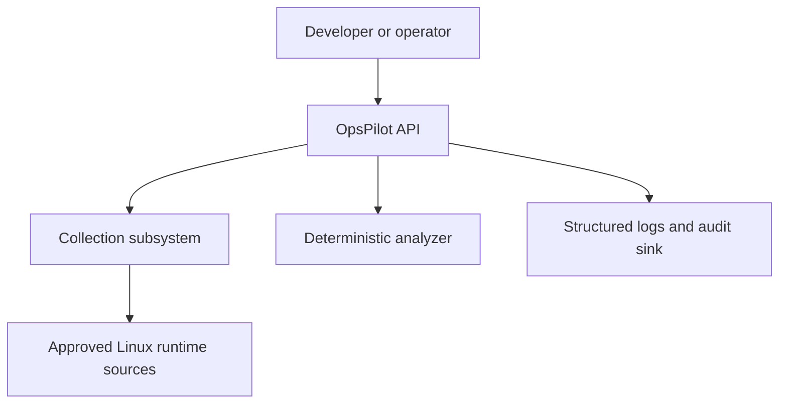
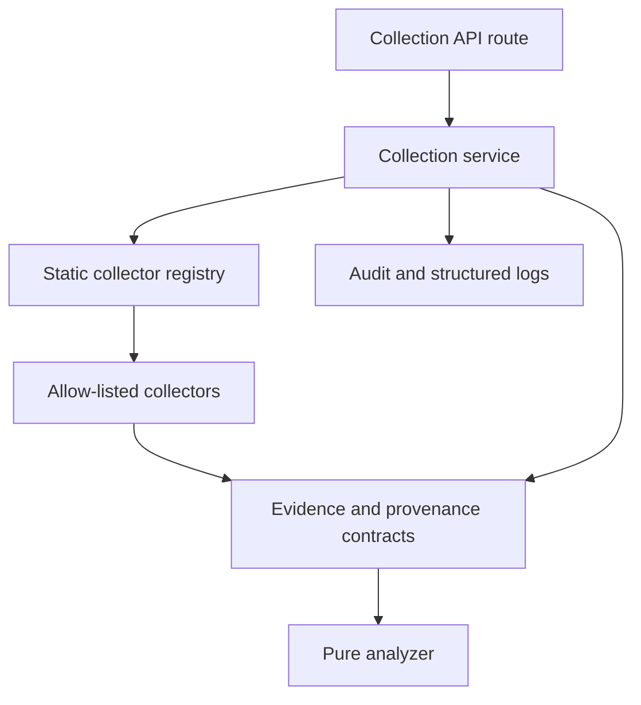
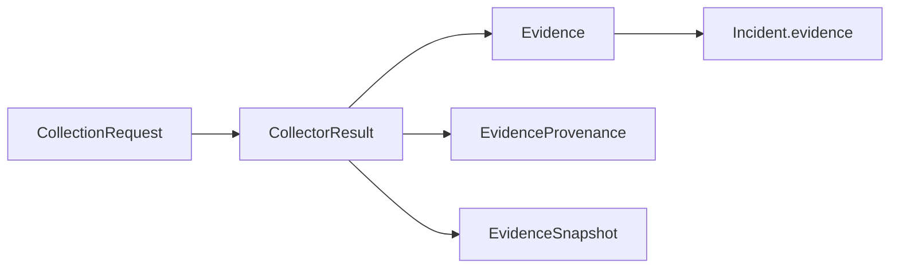
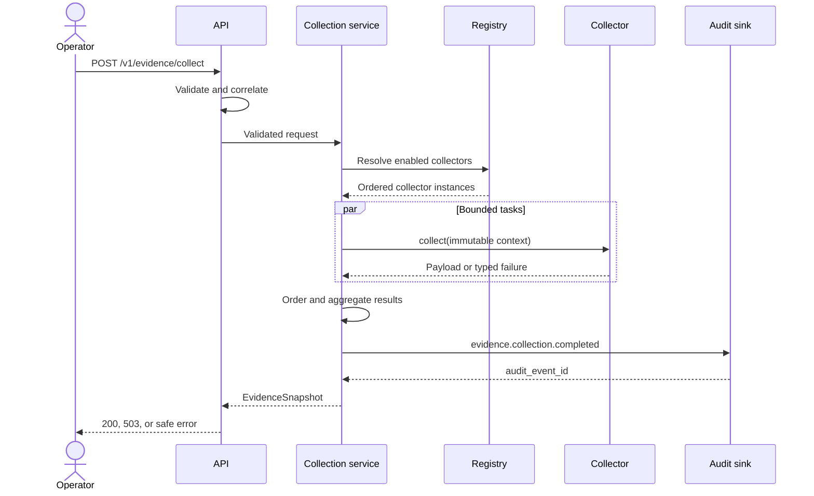
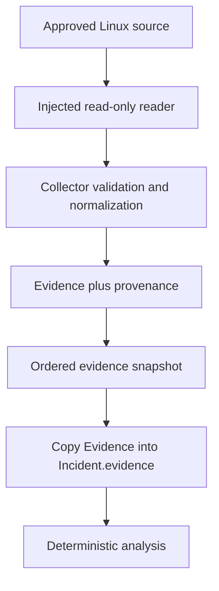

# Evidence Collection Architecture

| Field | Value |
|---|---|
| Status | Proposed |
| Scope | Local, read-only Linux evidence collection |
| Related issue | [#32](https://github.com/standardforever/ops_pilot/issues/32) |
| Requirements | [Week 2 requirements](../requirements/week-02.md) |
| Decision record | [ADR-0004](adr/0004-read-only-collector-interface.md) |

## Purpose

This document defines the Week 2 evidence-collection architecture. It adds a
bounded observation path to OpsPilot without weakening the read-only boundary
established in Week 1.

The architecture lets an operator request approved Linux measurements, receive
versioned evidence and provenance, and reuse that evidence in deterministic
incident analysis. It does not introduce commands, infrastructure credentials,
remote access, dynamic plugins, or remediation.

## Design principles

- Observation and analysis are separate responsibilities.
- A collector can observe one allow-listed source category only.
- Registration is an application decision; an API caller cannot choose code.
- Configuration can narrow approved behavior but cannot add implementations.
- Collector failures remain local to that collector.
- Missing data is represented explicitly and is never replaced by a guess.
- Every successful evidence item has matching provenance.
- The analyzer remains pure and performs no collection I/O.
- Results are deterministic in shape and order even when work runs concurrently.
- Future providers must fit the same domain boundary without leaking SDK types.

## System context



The operator sends a versioned collection request. The collection subsystem
observes only approved sources in the OpsPilot process's runtime namespace. The
result can be returned directly or copied unchanged into an incident request for
analysis. Collection and analysis both emit safe operational metadata, but
neither can execute an infrastructure action.

## Component view



| Component | Responsibility | Prohibited behavior |
|---|---|---|
| Collection API route | Validate HTTP input, establish correlation, call the collection service, and map domain outcomes to documented HTTP responses | Selecting implementation objects, reading Linux sources, applying analysis rules, or exposing internal errors |
| Collection service | Resolve requested names, schedule bounded work, enforce independent deadlines, isolate failures, aggregate ordered results, and require an audit event | Reading source files directly, inventing evidence, dynamically importing code, or mutating returned domain objects |
| Static collector registry | Map approved stable names to already-constructed collector instances and expose only enabled entries | Runtime discovery, entry-point loading, arbitrary import paths, caller-supplied factories, or registration after startup |
| Collector | Read one approved source category and return a complete immutable payload or a typed non-success outcome | Shell commands, subprocesses, writes, network calls unless a future provider explicitly allows them, global-state mutation, logging raw evidence, or returning partial unprovenanced evidence |
| Source reader | Encapsulate the minimum read-only operating-system API and make it replaceable in tests | Accepting caller-controlled paths, broad filesystem traversal, or transforming values into domain conclusions |
| Domain contracts | Validate requests, evidence, provenance, collector outcomes, snapshots, and safe errors | Importing FastAPI, provider SDKs, or runtime source readers |
| Deterministic analyzer | Interpret validated incident evidence using deterministic rules | Calling the registry, collectors, filesystem, network, or audit sink |
| Audit sink | Record a typed completion event for an attempted collection | Receiving raw procfs content, controlling collection outcomes, or making analysis decisions |
| Structured logging | Emit allow-listed metadata linked by correlation and collection IDs | Logging evidence values, complete payloads, raw source content, environment mappings, or machine-specific paths |
| Configuration | Validate enabled collectors, deadlines, and disk paths at startup | Adding implementation code, accepting API overrides, or reading unrelated credentials |

## Runtime contracts

The architecture uses the versioned models defined by the Week 2 requirements.
The central relationship is:



### Collector interface

The logical interface is asynchronous and provider-neutral:

```python
class Collector(Protocol):
    @property
    def descriptor(self) -> CollectorDescriptor: ...

    async def collect(self, context: CollectionContext) -> CollectorPayload: ...
```

The types have distinct responsibilities:

- `CollectorDescriptor` is immutable metadata: stable name, version, supported
  target type, and capability identity.
- `CollectionContext` is an immutable, application-created object containing the
  validated target, observation time provider, ID provider, and only the
  collector-specific configuration that the application owns.
- `CollectorPayload` is an all-or-nothing immutable tuple of `Evidence` and
  matching `EvidenceProvenance` records.
- `CollectorResult` is created by the collection service. It adds status, timing,
  duration, and safe errors to a successful payload or non-success outcome.

Collectors do not construct the aggregate snapshot and do not receive the API
request object. This prevents transport concerns and caller-controlled extension
data from crossing the collector boundary.

### Registry interface

The registry is assembled once during application startup from explicit code:

```python
registry = CollectorRegistry(
    collectors=(
        LinuxLoadCollector(...),
        LinuxMemoryCollector(...),
        LinuxDiskCollector(...),
    ),
    enabled_names=settings.enabled_collectors,
)
```

The registry validates that names are unique, known, and compatible with the
supported target type. Startup fails if enabled configuration cannot be resolved.
After construction the registry is immutable.

There is no import string, plugin directory, Python entry point, reflection-based
discovery, or registration endpoint. Adding a collector requires a reviewed code
change, tests, and an explicit registry entry.

## Collection request flow



Detailed behavior:

1. Middleware accepts a valid correlation ID or generates a safe one.
2. The route validates schema version, target, and one to three unique names.
3. The collection service resolves every name before starting any collector.
4. An unknown, disabled, duplicate, or unsupported request stops before work.
5. The service assigns each collector its request index and immutable context.
6. Collectors run as asynchronous tasks under a request-scoped concurrency bound
   no greater than the validated request maximum of three.
7. Each invocation is wrapped in its own configured deadline.
8. The service maps success, unavailable data, safe collector failure, timeout,
   and unexpected exceptions to a `CollectorResult`.
9. Results are assembled by original request index, never completion order.
10. The service derives aggregate status and limitations.
11. A required typed audit event is recorded using safe metadata.
12. The route maps the snapshot to HTTP 200 or 503. A required audit failure maps
    to the existing safe HTTP 500 response instead of claiming success.

## Source-to-analysis data flow



1. A source reader obtains only the fields required by its collector.
2. The collector parses, range-checks, normalizes units, and calculates only the
   derived values authorized by the requirements.
3. It creates evidence and one matching provenance record per evidence ID.
4. The service rejects a payload whose evidence/provenance relationship is not
   one-to-one.
5. Successful payloads are placed in the ordered snapshot.
6. A caller may copy the returned `Evidence` objects unchanged into
   `Incident.evidence`.
7. The analyzer uses evidence IDs and documented thresholds. It does not receive
   source readers, collector instances, or the registry.

Provenance stays in the collection snapshot. The stable evidence ID and source
field link the reused evidence to its collector result without changing the
existing incident contract.

## Concurrency, timeout, and isolation

### Scheduling decision

Collection uses bounded concurrent asynchronous tasks. The maximum request size
is three and the concurrency bound must never exceed that value. The collection
service owns scheduling; collectors cannot create unbounded background work.

Concurrency reduces additive latency and supports future network-bound providers.
Determinism is preserved by storing each outcome against its request index and
assembling the snapshot only after all tasks have reached a terminal state.

### Per-collector deadline

Each call is wrapped by the service in an independent timeout using the validated
`OPSPILOT_COLLECTOR_TIMEOUT_SECONDS` setting. A timeout cancels the async task and
produces `status=timed_out` with a stable safe error.

Collector implementations must cooperate with cancellation at await points.
Provider clients must also receive a timeout no longer than the remaining
collector deadline. A collector must not suppress cancellation.

Small blocking standard-library reads may execute through an injected reader in a
worker thread. Cancellation may not stop an operating-system call already in
progress, so the following containment rules apply:

- Readers and collectors are read-only.
- They receive no mutable aggregate or audit object.
- Their inputs and outputs are request-scoped and immutable.
- Only the collection service may publish a completed payload.
- A result arriving after the deadline is discarded.
- No timed-out operation may register callbacks or update shared state.

These rules ensure that a late read cannot corrupt or change the reported
snapshot even if the underlying operating-system call finishes after cancellation.

### Failure aggregation

| Collector outcomes | Snapshot status | HTTP status | Behavior |
|---|---|---|---|
| Every collector succeeds | `succeeded` | 200 | Return all ordered evidence and provenance |
| At least one succeeds and at least one does not | `partial` | 200 | Preserve successes; include safe errors and limitations |
| No collector succeeds | `failed` | 503 | Return typed failures with no fabricated evidence |
| Required audit write fails | No success reported | 500 | Return the existing safe error contract |

An exception from one task is captured at the task boundary. It cannot cancel or
overwrite completed sibling results. Unexpected exception details are logged only
after redaction and are not returned to the caller.

## Trust boundaries

| Boundary | Threat | Control |
|---|---|---|
| Caller to API | Path injection, arbitrary parameters, unknown implementations, malformed payloads | Strict request model; no paths, URLs, imports, commands, or free-form collector options |
| API to collection service | Framework data bypasses domain validation | Pass validated domain request and correlation context only |
| Service to registry | Disabled or unreviewed collector executes | Immutable static registry and resolve-all-before-run behavior |
| Registry to collector | Name collision or target mismatch | Startup validation of descriptor uniqueness and supported target |
| Collector to Linux source | Broad filesystem access, mutation, or privilege escalation | Allow-listed readers, read-only APIs, no shell, no Docker socket, no added capability |
| Collector to domain | Fabricated, partial, or unprovenanced evidence | Strict immutable payload and one-to-one provenance invariant |
| Service to telemetry | Raw evidence or system details leak | Safe-field allow-list and central recursive redaction |
| Snapshot to analyzer | Collection I/O becomes analysis behavior | Existing `Evidence` contract only; analyzer has no collector dependency |
| Build/configuration to runtime | Dynamic code or credentials enter the process | Locked dependencies, explicit wiring, validated settings, and no provider credentials in Week 2 |

## Configuration ownership

Configuration is loaded and validated once at application startup.

| Setting | Owner | Default | Boundary |
|---|---|---|---|
| `OPSPILOT_ENABLED_COLLECTORS` | Application operator | `linux.load,linux.memory,linux.disk` | May enable only names compiled into the registry |
| `OPSPILOT_COLLECTOR_TIMEOUT_SECONDS` | Application operator | `2.0` | Valid range is 0.1 through 30.0 seconds |
| `OPSPILOT_DISK_PATHS` | Application operator | `/` | Normalized, unique absolute paths; never supplied by an API caller |

Week 2 supports the root disk path only as the required portable behavior.
Additional operator-configured paths may be enabled only when the implementation
can return stable public resource identifiers without exposing machine-specific
paths. Until that contract is implemented and tested, configuration containing
additional paths fails closed.

API requests can choose only a subset of enabled collector names. They cannot
override timeouts, paths, reader behavior, source references, or implementation
versions.

## Observation scope

Linux evidence describes the runtime namespace visible to the OpsPilot process.
When OpsPilot runs in its container, procfs and filesystem statistics normally
describe that container's namespace and mounted filesystem view; they do not
prove the state of the physical host.

The API therefore uses the target identifier `local-runtime`, and documentation,
evidence source names, limitations, and demonstrations must not label these values
as physical-host measurements.

OpsPilot does not mount host procfs, the Docker socket, host devices, or privileged
paths. It does not run privileged, add Linux capabilities, or require a writable
root filesystem to collect evidence.

Readiness validates configuration and registry construction only. It does not
require every runtime evidence source to be currently available. Source
availability is a collection outcome, not an application-readiness condition.
This avoids making a transient optional source failure remove an otherwise safe
API instance from service.

## Test seams and dependency injection

The production composition root constructs concrete dependencies. Tests replace
interfaces directly rather than patching global runtime state.

| Seam | Production implementation | Test implementation |
|---|---|---|
| Clock | Timezone-aware system clock | Fixed clock |
| ID provider | UUID generator | Sequence or fixed IDs |
| Load reader | Narrow procfs/CPU-count reader | Fixture-backed reader |
| Memory reader | Narrow procfs reader | Fixture-backed reader including malformed cases |
| Disk reader | Narrow filesystem-stat reader | In-memory fake with explicit totals |
| Registry | Immutable configured registry | Registry of fake collectors |
| Collector | Linux collector | Success, unavailable, failure, timeout, and cancellation fakes |
| Audit sink | Structured local sink | Capturing sink and failing sink |
| Logger | Structured application logger | Capturing logger |

Required verification includes:

- Registry uniqueness, enablement, target, and fail-closed startup tests
- Parser tests using fixed Linux fixtures
- Collector tests for successful and malformed sources
- Orchestration tests for independent timeout and failure isolation
- Concurrency tests proving request-scoped state cannot leak
- Ordering tests with collectors completing out of order
- Contract tests for exact evidence/provenance pairing
- API tests for every documented status and rejection path
- Log and audit tests that enforce the safe-field allow-list
- Integration tests that copy collected evidence into incident analysis
- Static checks rejecting subprocess, dynamic import, entry-point discovery, and
  Docker socket use in the collection package

Tests do not rely on current machine measurements, internet access, sleeps, or
real deadlines. Fakes use controlled synchronization so concurrency and timeout
behavior are deterministic.

## Extension rules

Future AWS, Kubernetes, and observability collectors may implement the same
interface only after their own requirements and threat model are approved.

Every future collector must:

1. Use a stable, namespaced descriptor such as `aws.ec2.instance` or
   `kubernetes.pod`.
2. Be wired explicitly into the composition root and static registry.
3. Declare one bounded source capability and supported target type.
4. Use a narrow injected client interface rather than expose provider SDK objects.
5. Request least-privilege, read-only credentials through the platform's approved
   identity boundary.
6. Enforce a provider timeout within the service-owned collector deadline.
7. Normalize provider data into existing evidence/provenance contracts.
8. Map unavailable, throttled, unauthorized, and failed states to stable safe
   errors without inventing values.
9. Redact provider identifiers and payloads according to an approved policy.
10. Add offline contract tests and controlled integration tests.
11. Avoid importing provider SDKs into domain or analysis packages.
12. Require a reviewed code and configuration change; runtime plugin installation
    remains prohibited.

Provider-specific pagination, retries, rate limiting, and credentials remain
inside the adapter boundary. They must not change the analyzer or allow an API
caller to select arbitrary endpoints, regions, clusters, namespaces, or resource
paths without a separately validated target contract.

## Security invariants

The Week 2 implementation is acceptable only while all of these remain true:

- No collection path executes a command, script, subprocess, or external binary.
- No runtime module discovery, arbitrary import path, or entry-point loading exists.
- No API field can select a filesystem path, executable, URL, or implementation.
- No Docker socket, privileged container, added capability, or host procfs mount is
  required.
- No AWS, Kubernetes, Terraform, Ansible, SSH, or AI-provider credential is loaded.
- No unsuccessful collector returns evidence.
- No successful evidence lacks exactly one provenance record.
- No timed-out collector can publish a late result or mutate an aggregate.
- No raw source content or evidence value is logged by default.
- No analyzer code imports or calls a collector or source reader.
- No collection result authorizes or executes a proposed action.

## Verification allocation

| Concern | Primary evidence |
|---|---|
| Interface and domain invariants | Contract and unit tests in #33 |
| Registry, scheduling, timeout, and isolation | Service tests in #34 |
| Linux source allow-list and normalization | Collector tests in #35 |
| HTTP and OpenAPI behavior | API tests in #36 |
| Evidence reuse without I/O coupling | Analyzer and integration tests in #37 |
| Safe logs, audit, and redaction | Telemetry tests in #38 |
| Container, CI, dependency, and security controls | Verification work in #39 |
| Reproducible acceptance flow | Runbook and demonstration in #40 |

## Review checklist

- Each component has one clear responsibility and explicit prohibited behavior.
- All requested collector names resolve before any work begins.
- The registry cannot load code from caller or configuration input.
- Independent failures and deadlines cannot corrupt sibling results.
- Output order matches request order, not completion order.
- Every evidence record has matching provenance.
- Disk paths belong to validated startup configuration.
- Runtime scope is described accurately.
- The analyzer remains pure and independent from collection I/O.
- Future providers fit behind the same domain boundary.

