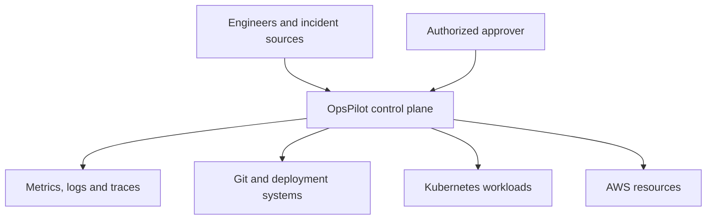
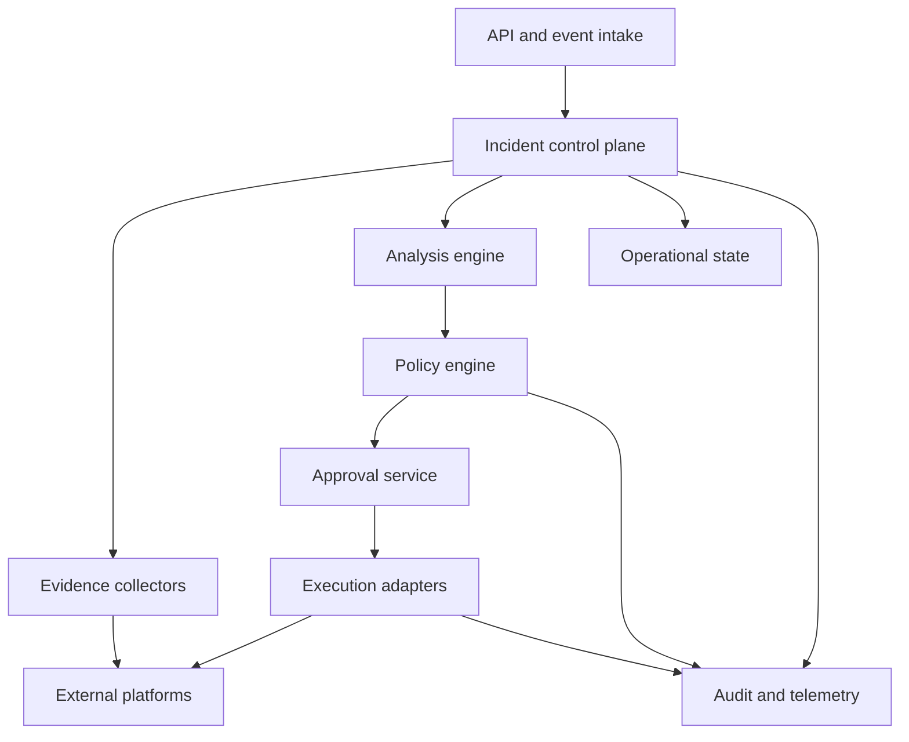
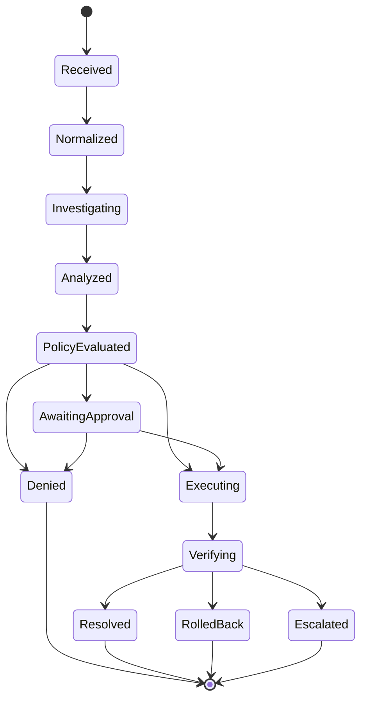

# OpsPilot Architecture Overview

## Purpose

This document describes the target architecture for OpsPilot. The platform is being implemented incrementally; components described here may not yet exist in the repository.

OpsPilot coordinates infrastructure incident analysis and operational response while maintaining separation between evidence collection, analysis, policy, approval, and execution.

## Architectural principles

- Analysis does not grant permission to execute.
- Every external integration begins with least-privilege, read-only access.
- Untrusted incident content cannot become an executable command.
- Proposed actions must be structured, validated, risk-classified, and allow-listed.
- Policy evaluation is independent from the analysis component.
- High-risk and production changes require an authorized approver.
- State transitions and external effects are idempotent where possible.
- Mutating actions require post-condition verification and a rollback or compensating path.
- Important decisions, approvals, actions, and outcomes are correlated and auditable.
- Missing policy, expired approval, insufficient evidence, or failed verification stops the workflow safely.

## System context

## Component architecture

### API and event intake

The intake layer accepts incidents and operational signals from authenticated users and approved systems.

Responsibilities:

- Authentication and request authorization
- Schema and size validation
- Severity and source normalization
- Idempotency-key handling
- Deduplication and correlation
- Initial audit event creation
- Rejection of unsupported or malformed inputs

The intake layer cannot execute infrastructure actions.

### Incident control plane

The control plane owns the incident lifecycle and coordinates the other components.

Responsibilities:

- State-machine transitions
- Evidence-collection requests
- Analysis orchestration
- Retry, timeout, cancellation, and escalation
- Policy and approval coordination
- Verification and rollback coordination
- Final outcome recording

It should pass references to credentials rather than receive unrestricted credential values.

### Evidence collectors

Collectors retrieve operational context from one approved source each.

Potential sources include:

- Prometheus metrics
- Application and platform logs
- Distributed traces
- Kubernetes API objects and events
- Argo CD deployment state
- GitHub commits and pull requests
- Terraform state and plans where access is appropriate
- AWS resource state and CloudWatch telemetry

Collectors use time-bounded, read-only, source-specific permissions. Collected data is normalized, size-limited, and redacted before it is provided to analysis components.

### Analysis engine

The analysis engine converts evidence into structured hypotheses and recommendations.

The engine may use deterministic rules, statistical methods, or AI models. All implementations must produce the same validated output contract containing:

- Evidence references
- Hypotheses and likely causes
- Confidence and uncertainty
- Recommended investigation steps
- Structured proposed actions
- Required preconditions
- Risk metadata

The analysis engine cannot approve or execute its recommendations.

### Policy engine

The policy engine evaluates proposed actions against organizational rules.

Inputs may include:

- Action type
- Target resource and environment
- Incident severity
- Evidence confidence
- Blast radius
- Time window
- Requester and approver identity
- Required rollback capability

The output is a structured decision: deny, allow as read-only, require approval, or allow within explicitly bounded conditions.

### Approval service

The approval service captures authorization from an eligible human or trusted system.

An approval is bound to:

- A specific action and target
- Defined parameters
- An approver identity and role
- A validity period
- The policy decision and evidence version

Material changes to the action, target, parameters, evidence, or policy require new approval.

### Execution adapters

Execution adapters translate approved actions into narrow provider-specific operations.

An adapter must:

- Expose allow-listed actions instead of arbitrary shell access
- Validate parameters and preconditions
- Use short-lived, least-privilege credentials
- Enforce deadlines and concurrency controls
- Return structured results
- Support dry-run behavior where possible
- Provide rollback or a compensating procedure for mutations
- Emit start, completion, failure, and verification events

### State and audit

Operational state records the current incident and workflow position. Audit storage preserves the historical decision chain.

Audit records should connect:

- Incident input
- Evidence references and versions
- Analysis result
- Policy decision
- Approval
- Execution request and response
- Verification result
- Rollback or escalation outcome

Audit records should be append-oriented and protected through retention and restricted-modification controls.

## Incident lifecycle

The workflow can stop without execution after analysis, denial, approval expiry, insufficient evidence, or an unsafe precondition.

## AWS deployment mapping

The exact services require architecture decision records. The initial target mapping is:

| Responsibility | Proposed implementation |
|---|---|
| Service runtime | Amazon EKS |
| Container registry | Amazon ECR |
| Event delivery and buffering | Amazon EventBridge and Amazon SQS where appropriate |
| Operational metadata | Managed PostgreSQL-compatible database |
| Evidence and audit artifacts | Amazon S3 with encryption and retention controls |
| Workload identity | AWS IAM and Kubernetes workload identity |
| Secret storage | AWS Secrets Manager |
| Infrastructure provisioning | Terraform |
| Configuration automation | Ansible only when Terraform or Kubernetes reconciliation is not appropriate |
| Kubernetes packaging | Helm |
| GitOps reconciliation | Argo CD |
| Metrics and dashboards | Prometheus and Grafana |
| AWS-native telemetry | Amazon CloudWatch where appropriate |
| Continuous integration | GitHub Actions |

## Observability

OpsPilot must observe itself as carefully as the systems it investigates.

The platform should expose:

- Request and incident throughput
- Evidence-collection latency and failures
- Analysis latency and confidence distribution
- Policy decisions and denial reasons
- Approval latency and expiry
- Execution, verification, and rollback results
- Queue depth and workflow age
- External dependency errors
- Audit-pipeline failures

Logs, metrics, and traces use a shared correlation identifier. Sensitive fields must be redacted before emission.

## Failure handling

The design assumes partial failure.

- Duplicate requests are handled idempotently.
- Collectors can fail independently without fabricating evidence.
- Timeouts produce explicit, auditable outcomes.
- Retries use bounded attempts and backoff.
- Policy or approval outages stop execution.
- Executor failures trigger verification and, where safe, rollback.
- Audit-write failures prevent privileged action completion from being reported as successful.
- Ambiguous outcomes are escalated rather than guessed.

## Evolution strategy

The system should progress in this order:

1. Local, deterministic, read-only incident analysis
2. Structured audit and platform observability
3. Read-only evidence integrations
4. AWS infrastructure and cloud-native deployment
5. Policy, approval, and action catalog
6. Bounded execution with verification and rollback
7. Evaluated AI-assisted analysis and operations

Each stage must preserve the trust boundaries established by the preceding stages.
