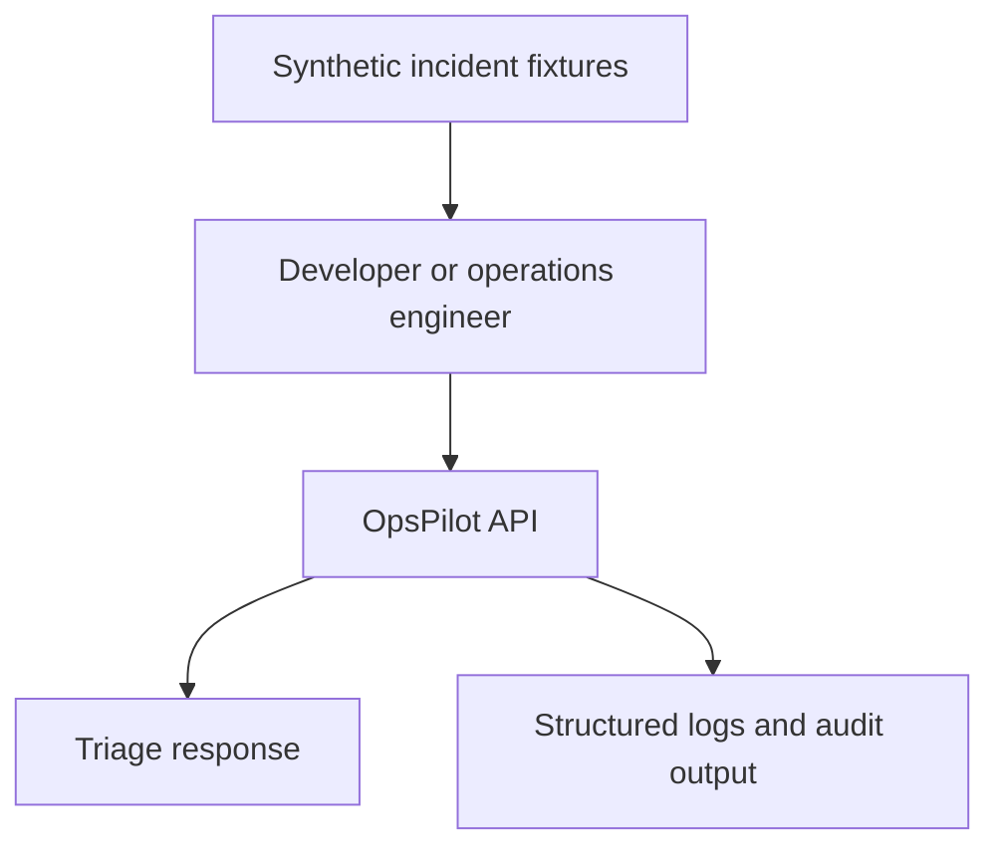
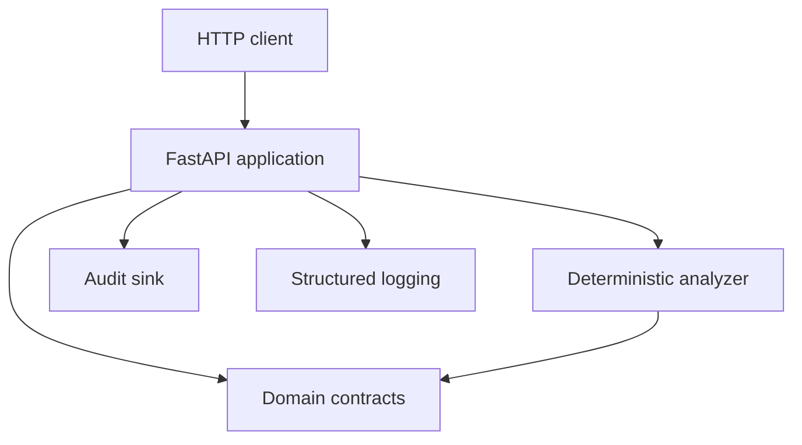
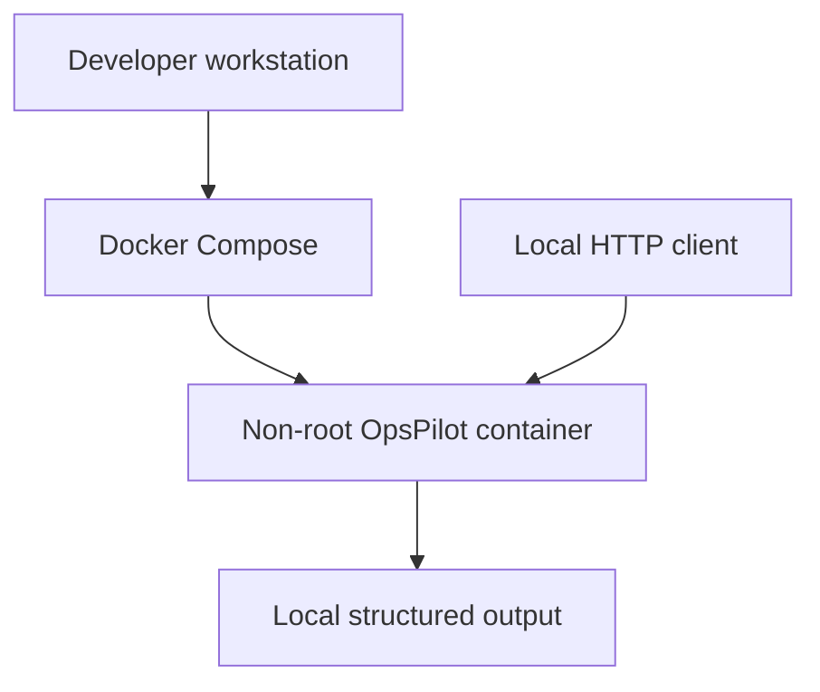

# Initial System Context

| Field | Value |
|---|---|
| Status | Proposed |
| Related issue | [#3](https://github.com/standardforever/ops_pilot/issues/3) |
| Requirements | [Week 1 requirements](../requirements/week-01.md) |
| Target architecture | [Architecture overview](overview.md) |

## Purpose

This document defines the architecture for the first executable OpsPilot slice. It translates the approved requirements into components, interfaces, trust boundaries, and verification responsibilities.

The initial architecture is deliberately smaller than the target platform. It proves the incident-analysis contract and safety model without introducing cloud access, external AI providers, persistent storage, or execution capability.

## Context

The user submits synthetic data to a local API. OpsPilot validates and analyzes that data, then returns a triage plan and emits structured audit information. No external infrastructure system participates in this flow.

## Container view

| Component | Responsibility | May not do |
|---|---|---|
| FastAPI application | HTTP routing, request validation, correlation, response mapping, and error handling | Implement diagnostic rules or execute commands |
| Domain contracts | Define and validate incidents, evidence, hypotheses, recommendations, action proposals, audit events, and errors | Import the web framework or infrastructure SDKs |
| Deterministic analyzer | Map validated incidents and evidence to structured triage plans | Perform I/O, call external systems, approve actions, or mutate state |
| Audit sink | Accept structured audit events through an interface | Control analysis behavior or contain real secrets |
| Structured logging | Emit machine-readable operational events with redaction | Store complete sensitive payloads |
| Configuration | Load and validate environment-derived settings | Read cloud credentials or perform network calls |

## Request flow

1. The client submits a versioned incident to `POST /v1/incidents/analyze`.
2. Middleware accepts a valid correlation ID or generates one.
3. The API validates the request against the incident contract.
4. Invalid input returns the documented 4xx error contract.
5. Valid input is passed to the deterministic analyzer.
6. The analyzer selects the matching rule or the unknown-signal fallback.
7. The analyzer returns a domain-level triage plan.
8. The API creates an `analysis.completed` audit event.
9. The audit sink records the event without sensitive input payloads.
10. The API returns the versioned triage response with correlation and audit identifiers.

## Interface boundaries

### HTTP boundary

- Accept only JSON that satisfies the supported API contract.
- Enforce payload-size and content-type limits.
- Do not expose internal stack traces.
- Return stable, documented error responses.

### Domain boundary

- Domain models are independent of FastAPI.
- All enumerations and constrained values validate centrally.
- Unsupported actions fail validation.
- Action proposals are data only and are never executable authorization.

### Analysis boundary

- The analyzer accepts validated domain objects.
- The analyzer has no shell, filesystem, cloud, Kubernetes, Git, or network adapter.
- The same semantic input produces the same semantic result.
- Unknown signals preserve uncertainty.

### Audit boundary

- The web layer emits typed audit events through an interface.
- The first implementation may use structured standard output or an in-memory test sink.
- The interface allows durable storage to be introduced later without coupling it to analysis.

## Trust boundaries

| Boundary | Threat | Control |
|---|---|---|
| Client to API | Malformed, oversized, or adversarial input | Schema, size, enum, and content-type validation |
| API to domain | Framework-specific data bypasses domain rules | Construct validated domain models before analysis |
| Domain to analyzer | Unsupported action or incident reaches rules | Exhaustive matching and fail-closed validation |
| Application to logs | Secrets or complete payloads are disclosed | Central redaction and structured safe fields |
| Application to runtime | Hidden external dependency or credential access | No cloud SDKs, no external AI client, offline tests |
| Build to container | Unnecessary privilege or source material | Multi-stage build, non-root user, minimal final image |

## Configuration

Configuration is environment-based and validated at startup. The initial service should require no secrets.

Expected configuration categories:

- Service name and version
- Environment name
- Log level and format
- Correlation-ID header name
- Payload-size limit
- Audit-sink selection for local/test environments

Configuration parsing belongs in one component rather than being spread across routes and analysis code.

## Error model

Errors are classified into:

- Request validation errors
- Unsupported schema versions
- Unsupported incident or action types
- Configuration errors
- Internal analysis errors
- Audit-sink errors

The external error response contains a stable code, safe message, correlation ID, and appropriate HTTP status. Internal details remain in redacted logs.

## Failure behavior

- Invalid input stops before analysis.
- Unknown signals return a limited investigation plan rather than an exception.
- Unsupported actions fail closed.
- Analyzer errors return a safe internal-error contract.
- Required audit-event failure prevents the analysis from being reported as successfully completed.
- Shutdown stops new requests and allows in-flight local work to complete within a bounded period.

## Deployment view

The first slice uses no database, message broker, Kubernetes cluster, or AWS resource. Those components belong to later architecture increments and must preserve the interfaces and trust boundaries defined here.

## Verification allocation

| Concern | Primary verification |
|---|---|
| HTTP behavior | API tests |
| Domain invariants | Unit and contract tests |
| Deterministic analysis | Fixture-driven unit tests |
| Correlation and audit | Middleware and audit-sink tests |
| Redaction | Security-focused log tests |
| Container privilege | Image inspection and smoke test |
| No external dependency | Offline test execution and dependency review |
| Clean setup | Documented clean-clone demonstration |

## Evolution toward the target architecture

The component boundaries intentionally match the long-term design:

- Deterministic analysis can later coexist with AI-assisted analyzers.
- The local audit sink can later be replaced by durable append-oriented storage.
- Evidence collectors can be added behind explicit read-only interfaces.
- Policy and approval remain separate components before execution is introduced.
- Execution adapters are not added until allow-listing, authorization, verification, and rollback requirements exist.

The first implementation must not create shortcuts that collapse these future trust boundaries.
